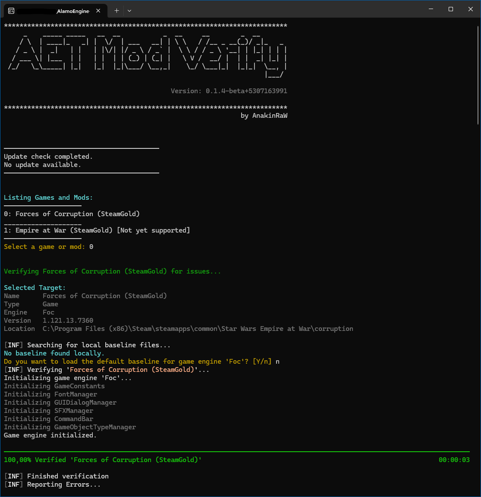

# ModVerify: A Mod Verification Tool
ModVerify is a command-line tool designed to analyze 
mods for the game Star Wars: Empire at War and its expansion Forces of Corruption 
for common errors in XML and other game files.

## Table of Contents

- [Installation](#installation)
- [Usage](#usage)
- [Getting Updates](#getting-updates)
- [Options](#options)
- [Available Checks](#available-checks)
- [Creating a new Baseline](#creating-a-new-baseline)

---

## Installation

Download the latest release from the [releases page](https://github.com/AlamoEngine-Tools/ModVerify/releases). There are two versions of the application available. 

1. `ModVerify.exe` (**recommended**): Use this if you simply want to verify your mods. This version only works on Windows.
2. `ModVerify-NetX.zip`: Cross-platform app. It works on Windows and Linux and is most likely the version you want to use to include it in some CI/CD scenarios.

You can place the files anywhere on your system, eg. your Desktop. There is no need to place it inside a mod's directory. 

***Note**: Only the Windows version supports automatic updates. 
Except for that both versions have the exact same feature set. 
They just target a different .NET runtime. Linux and CI/CD support is not fully tested yet. 
Current priority is on the Windows-only version.*

---

## Usage

Simply run the executable file `ModVerify.exe`. 

When given no specific argument through the command line, ModVerify will ask you which game or mod you want to verify. 
When ModVerify is done analyzing, it will write the verification results into a folder `ModVerifyResults` next to the executable. 



A `.JSON` file contains all identified issues. The additional `.txt` files contain the same errors but are grouped by the verifier that reported the issue. 
The text files may be easier to read, while the JSON file is more useful for 3rd party tool processing.  

*Vanilla Empire at War is currently not supported.*

---

## Getting Updates

ModVerify automatically check for updates. 

*The following applies to the Windows (.NET Framework) version only*

When executed with no arguments the application automatically checks for an available update and will ask you whether you want to update now.
Otherwise, the app only informs you whether an update is available.

You can use the dedicated `updateApplication` option to trigger an update.

```bash
.\ModVerify.exe updateApplication
```

***Note:***
You may be required to put ModVerify on your AntiVirus whitelist.

---

## Options

You can also run the tool with command line arguments to specify custom behavior. 

To see all available options, especially if you have custom folder setups, open the command line and type:

```bash
.\ModVerify.exe --help
```

In general ModVerify has two operation mods. 
1. `verify` Verifying a game or mod 
2. `createBaseline` Creating a baseline for a game or mod, that can be used for further verifications in order to verify you did not add more errors to your mods.

### Examples

#### Example 1: Auto-detection with a custom baseline
Analyzes a specific mod, uses the FoC baseline and writes the output into a dedicated directory:

**Windows:**
```bat
.\ModVerify.exe verify --path "C:\My Games\FoC\Mods\MyMod" --outDir "C:\My Games\FoC\Mods\MyMod\verifyResults" --baseline ./focBaseline.json
```

**Linux:**
```bash
./ModVerify verify \
  --path "/home/user/games/FoC/Mods/MyMod" \
  --outDir "/home/user/games/FoC/Mods/MyMod/verifyResults" \
  --baseline ./focBaseline.json
```

#### Example 2: Manual mod setup with sub-mods, EaW fallback and default baseline
Uses manual mod setup, including sub-mods and the EaW fallback game, and uses the default embedded baseline:

**Windows:**
```bat
.\ModVerify.exe verify --mods "C:\My Games\FoC\Mods\MySubMod;C:\My Games\FoC\Mods\MyMod" --game "C:\My Games\FoC" --fallbackGame "C:\My Games\EaW" --useDefaultBaseline
```

**Linux:**
```bash
./ModVerify verify \
  --mods "/home/user/games/FoC/Mods/MySubMod;/home/user/games/FoC/Mods/MyMod" \
  --game "/home/user/games/FoC" \
  --fallbackGame "/home/user/games/EaW" \
  --useDefaultBaseline
```

---

## Available Checks

The following verifiers are currently implemented: 

### SFX Events: 
- Checks whether coded presets exist
- Checks the referenced samples for validity (bit rate, sample size, channels, etc.)
- Duplicates

### GUIDialogs
- Checks the referenced textures exist

### GameObjects
- Checks the referenced models for validity (ALO file, textures, particles and shaders)
- Duplicates

### Engine
- Performs assertion checks the Debug builds of the game are also doing (not complete)
- XML errors and unexpected values

---

## Creating a new Baseline

If you want to create your own baseline use the `createBaseline` option. 

### Example
```bash
ModVerify.exe createBaseline --outFile myBaseline.json --path "C:\My Games\FoC\Mods\MyMod"
```
